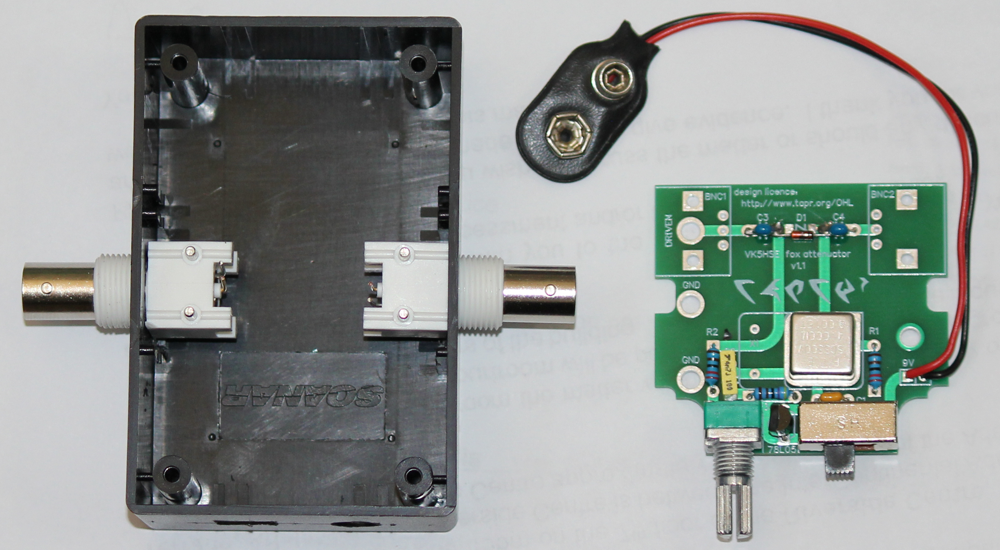
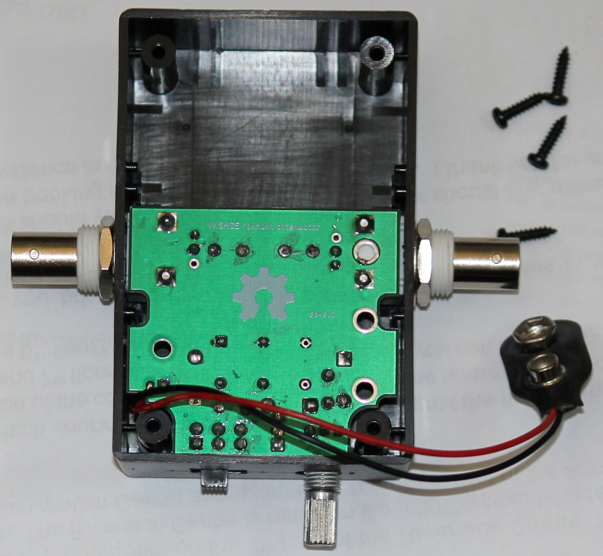
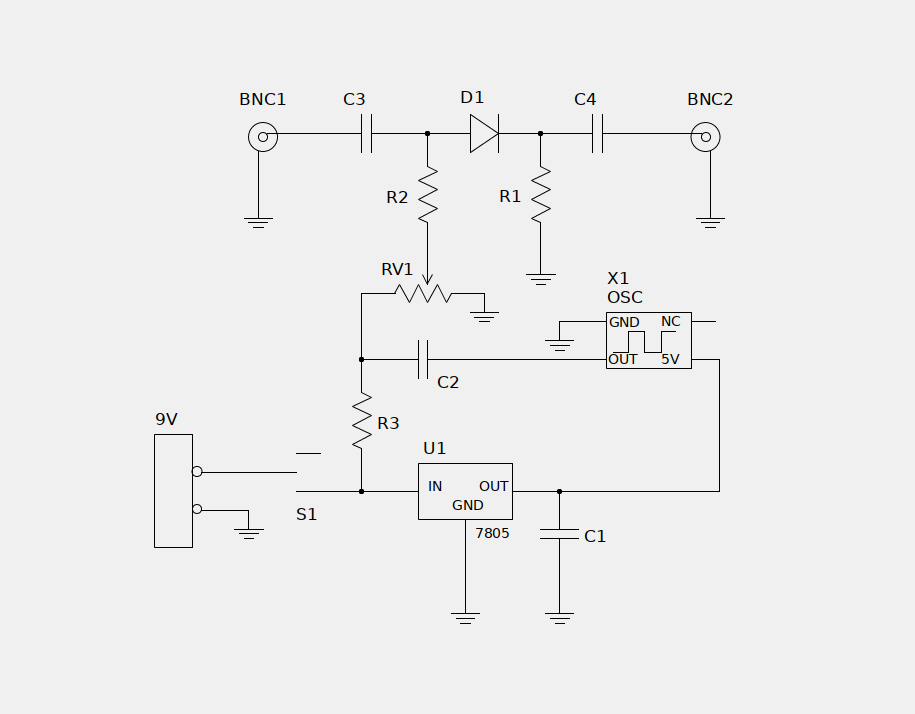
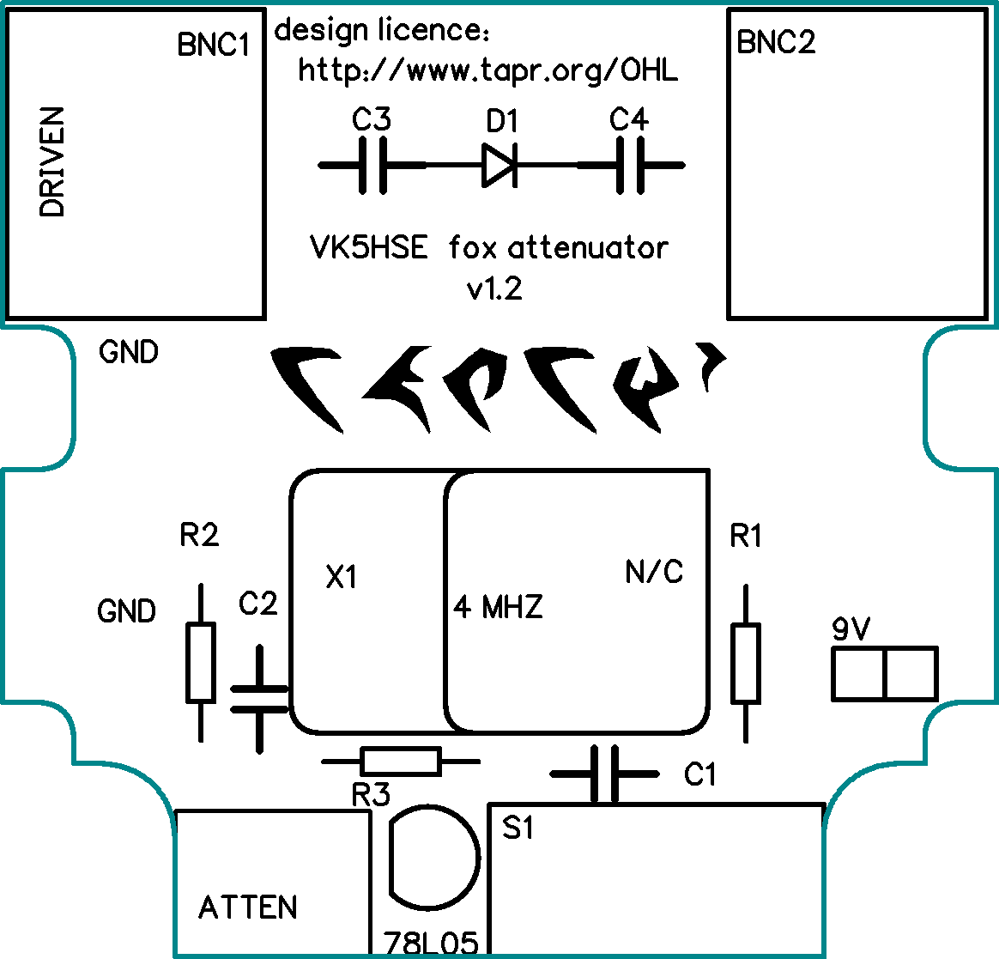
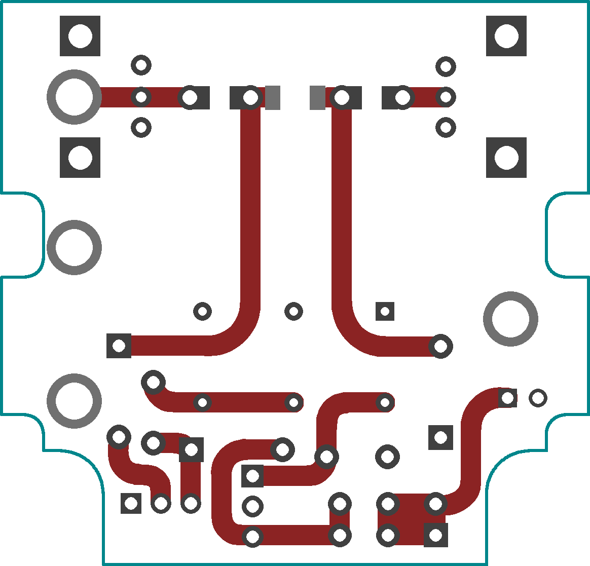
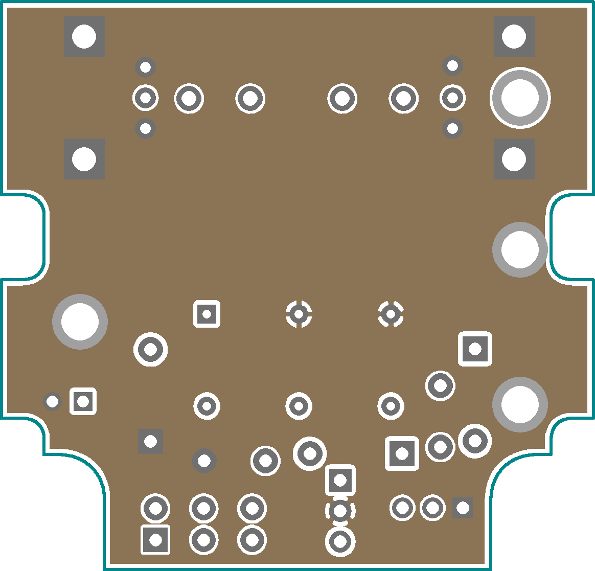
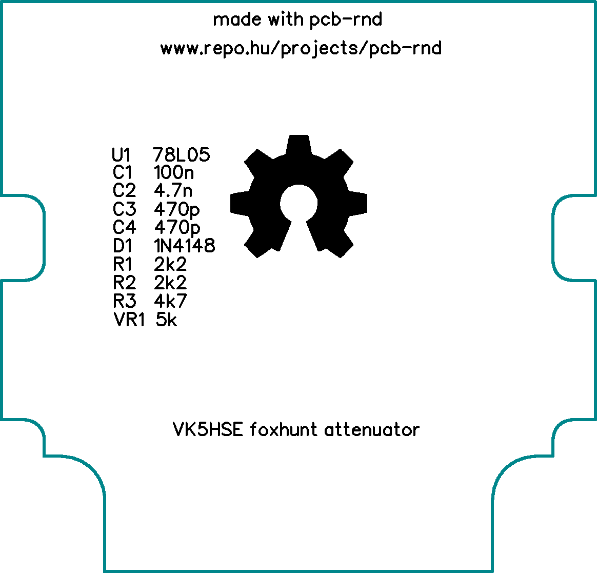

# VK5HSE frequency offset attenuator

This repository contains the design files and gerbers for the frequency offset attenuator published in AR magazine in March/April 2022.

The layout file VK5HSE-fox-attenuator-v1-2.lht can be opened and modified in the open source PCB layout editor pcb-rnd ( http://www.repo.hu/projects/pcb-rnd )

The gerbers have been exported using a fairly common naming convention compatible with seeed studio and other PCB fabricators. 

The box mounting hole dimensions suit Jaycar HB6015 or similar ABS "Jiffy Box" enclosures 

